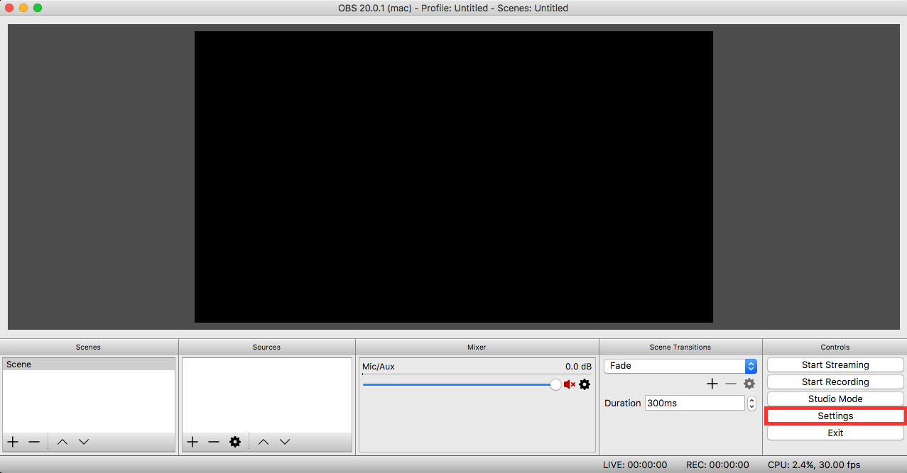
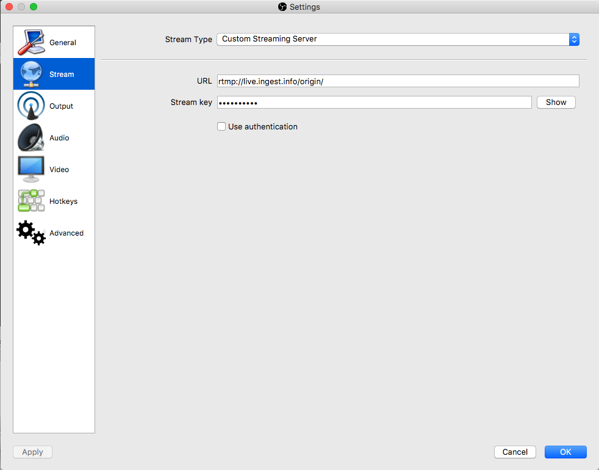
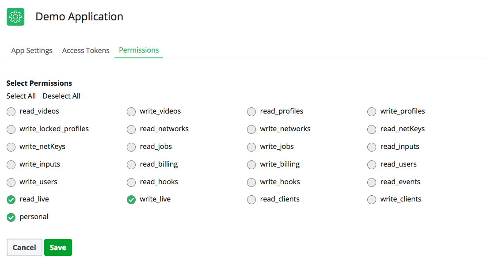
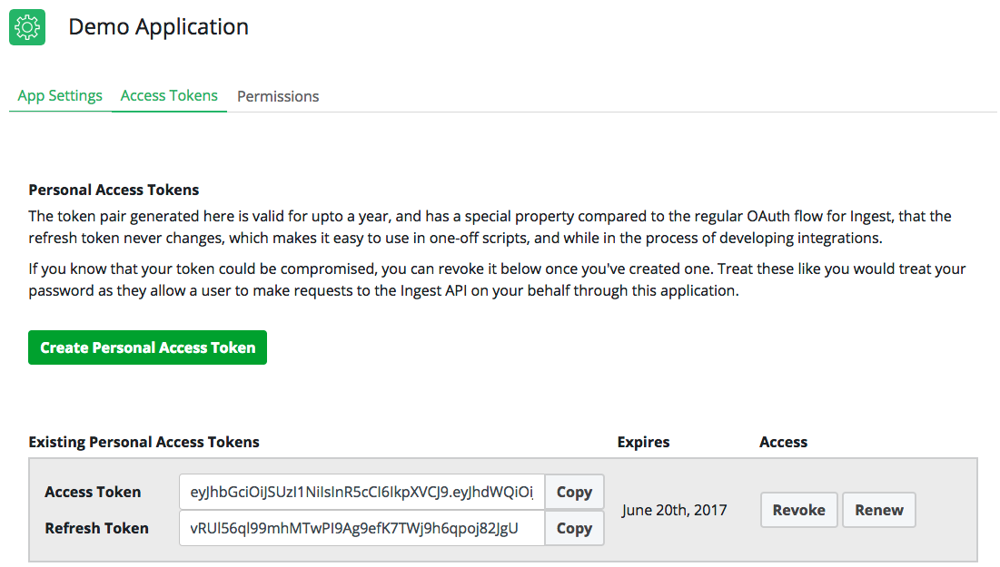

# Going Live with Ingest

It is a very short process to go live with Ingest, you can accomplish it in three steps.

## Getting a livestreaming client

For this example, we'll use Open Broadcasting Software. Download it for your computer platform at the [OBSProject website](https://obsproject.com/).

Once you have it installed on your computer, you should launch the program and go to settings.



From there, you can set where your content will be pushed. From the settings page you should do the following:



* Select the stream tab
* Change the stream type to `Custom Origin`
* Change the url field to `rtmp://live.ingest.io/origin/`

We'll come back to this to set the stream key once we've created our livestream in Ingest.

## Create a third-party integration

> _Note: We will do this using the API to demonstrate how easy it is to setup an application, and start to use our API, but you can also do this process via our [Dashboard](https://dashboard.ingest.io) in the livestreaming section and skip this step._

We'll visit the [Developer Center](https://dev.ingest.io) and create an application so we can get a authorization token to call the API on your behalf.

Once you've loaded the Developer Center, click "Get Started" to create an application. If you aren't logged in, you'll be prompted to login with your Ingest account.

Once you've created an application, go to the applications settings page by hitting the gear icon, or the title, and navigate to the Permissions tab, giving this application the following permissions: 
* `read_live`
* `write_live`
* `personal`

Hit save.



Then, proceed to the Access Tokens tab, and create a personal access token, and copy the access token portion. Now we can make authenticated requests to the Ingest API on behalf of your user.



> _Note: While the refresh token is valid for a year, the access token is only valid for a short-time, if you start to receive unauthorized errors from the API, press the renew button, and copy your token. For more information on how to do [this through the API](https://docs.ingest.io/#refreshing-your-token), or other [authentication flows](https://docs.ingest.io/#authentication), visit our [API documentation](https://docs.ingest.io)._

## Make the request

Now that we're authenticated, we can make the request from your terminal, or using a tool like Postman. Make sure to replace the `{{token}}` placeholder with the access token you copied from above. 

```
curl --request POST \
  --url https://api.ingest.io/live \
  --header 'accept: application/vnd.ingest.v1+json' \
  --header 'authorization: Bearer {{token}}' \
  --header 'content-type: application/json' \
  --data '{"title": "Creating a livestream"}'
```

Once you've sent this request, you'll receive a JSON response that looks something like:

```
{
    "id": "f179201b-6e58-4985-bd2d-cf3c42154054",
    "url": "https://api.ingest.io/live/f179201b-6e58-4985-bd2d-cf3c42154054",
    "stream_key": "i0qMxZrn3Y",
    "title": "Creating a livestream",
    "network_id": "7892184f-4613-44fb-9ae3-8ed726dedc3d",
    "rtmp_url": null,
    "play_url": null,
    "status": "CREATED",
    "created_at": "2017-09-21T21:13:07.515117Z",
    "finished_at": null,
    "deleted_at": null
}
```

You should copy the stream_key from the response, and input this back in the `Settings > Stream` Stream key field we have open in OBS.


Then we will send a subsequent GET request to the location identified in the `"url"` field and in a few seconds the `"status"` field will change to `"RUNNING"` and the `"play_url"` will be populated, which is where you can point a HLS player to watch your livestream!

Again, replace the `{{url}}` and `{{token}}` placeholders.

```
curl --request GET \
  --url {{url}} \
  --header 'accept: application/vnd.ingest.v1+json' \
  --header 'authorization: Bearer {{token}}' \
  --header 'content-type: application/json'
```

You'll receive another JSON object response assuming everything went well that looks like this.

```
{
	"id": "f179201b-6e58-4985-bd2d-cf3c42154054",
	"url": "https://api.ingest.io/live/f179201b-6e58-4985-bd2d-cf3c42154054",
	"stream_key": "i0qMxZrn3Y",
	"title": "Creating a livestream",
	"network_id": "7892184f-4613-44fb-9ae3-8ed726dedc3d",
	"rtmp_url": "rtmp://live.ingest.io/origin/i0qMxZrn3Y",
	"play_url": "https://stream.ingest.io/f179201b-6e58-4985-bd2d-cf3c42154054/master.m3u8",
	"status": "RUNNING",
	"created_at": "2017-09-21T21:13:07.515117Z",
	"finished_at": null,
	"deleted_at": null
}
```

## Go live!

Once you've done that, you can finish setting up OBS to stream your Webcam, media file, or your desktop by adding "Sources", setup your stage, and when your ready, press Start Streaming!

In just a few seconds your content will be online and your users can start to watch at the `"play_url"`. Without doing any work with video players, you can use the [Ingest video player demo page](https://demo.ingest.io), or play it natively in Safari or Microsoft Edge.

Thanks for following along, go build cool experiences!